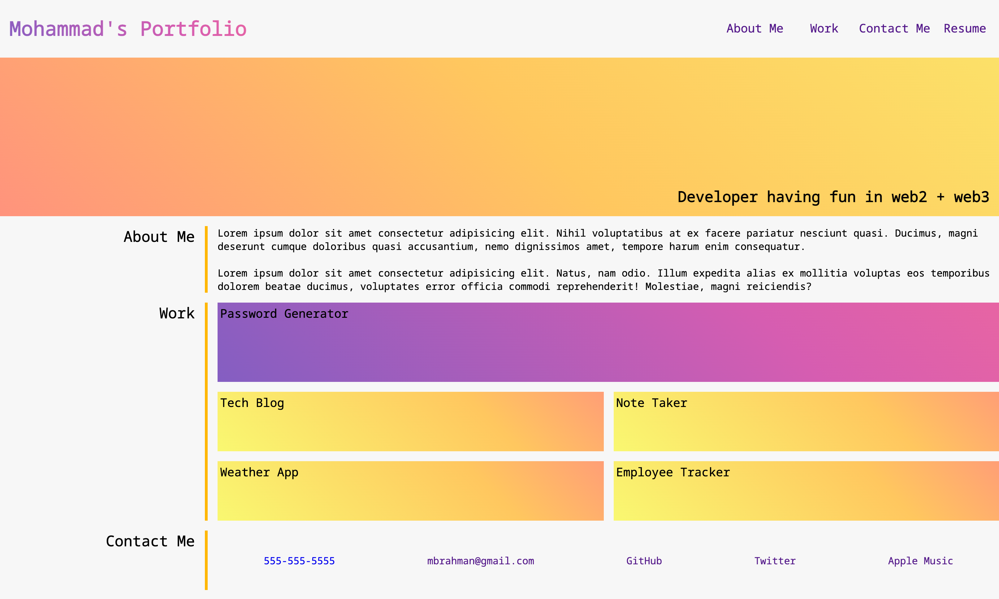
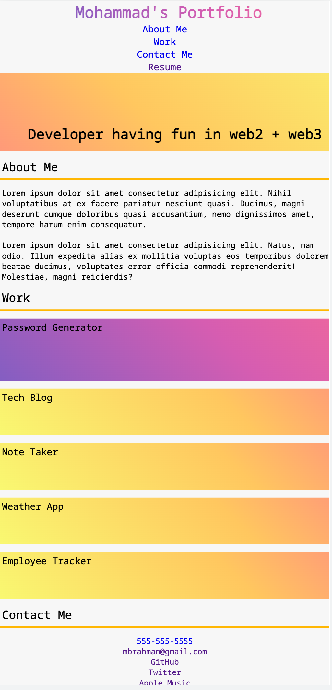

# Professional Portfolio v2.0 :unicorn::martial_arts_uniform:

#### This is the source repo for my portfolio site. It is built entirely with HTML5, CSS3 and Flexbox only. Check out the live site in the link below where you can find all my projects and contact info for any opportunities/feedback/questions.

### To use this Application

- [Go to live link](https://mrahma04.github.io/professional-portfolio-v2.0/)
- Click on Portfolio Links to GitHub repos
- Contact info/social media links

### User Story

```
AS AN employer
I WANT to view a potential employee's deployed portfolio of work samples
SO THAT I can review samples of their work and assess whether they're a good candidate for an open position
```

### Acceptance Criteria

```
GIVEN I need to sample a potential employee's previous work
WHEN I load their portfolio
THEN I am presented with the developer's name, a recent photo or avatar, and links to sections about them, their work, and how to contact them
WHEN I click one of the links in the navigation
THEN the UI scrolls to the corresponding section
WHEN I click on the link to the section about their work
THEN the UI scrolls to a section with titled images of the developer's applications
WHEN I am presented with the developer's first application
THEN that application's image should be larger in size than the others
WHEN I click on the images of the applications
THEN I am taken to that deployed application
WHEN I resize the page or view the site on various screens and devices
THEN I am presented with a responsive layout that adapts to my viewport
```

### Screenshots

#### Large Screens

#### Smaller Screens
